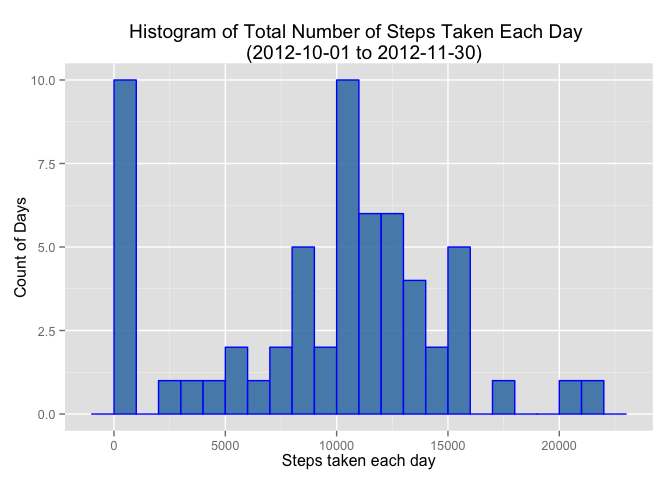
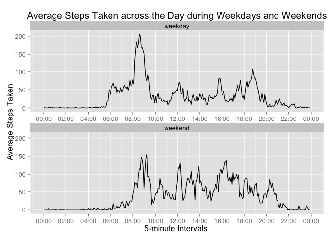

# Reproducible Research: Peer Assessment 1


Analysis of Activity Monitoring Device Data 
===========================================

## Loading and preprocessing the data


```r
Activity <- read.csv("activity.csv")
str(Activity)
```

```
## 'data.frame':	17568 obs. of  3 variables:
##  $ steps   : int  NA NA NA NA NA NA NA NA NA NA ...
##  $ date    : Factor w/ 61 levels "2012-10-01","2012-10-02",..: 1 1 1 1 1 1 1 1 1 1 ...
##  $ interval: int  0 5 10 15 20 25 30 35 40 45 ...
```

```r
## remove NA values of steps recorded and prepare the data frame to be analyzed with dplyr package.
suppressPackageStartupMessages(library(dplyr))
Activity_use <- tbl_df(Activity) %>%
        filter(steps != "NA" )
```


## What is mean total number of steps taken per day?
* The total number of steps taken per day during the monitored period is plotted in the histogram below. Its mean and median are calculated with the R codes below.


```r
## calculate the total number of steps taken per day
sum_day <- Activity_use %>%
        group_by(date) %>%
        summarise(sum_step_day = sum(steps))

## Plot histogram of the total number of steps taken each day
suppressPackageStartupMessages(library(ggplot2))
qplot(sum_day$sum_step_day, 
      grom="histogram", binwidth = 1000, 
      main = "Histogram of Total Number of Steps Taken Each Day \n  (2012-10-01 to 2012-11-30)",
      xlab = "Steps taken each day",
      ylab = "Count of Days",
      fill = I("steelblue"),
      col = I("blue"),
      alpha = I(.9))
```

 

```r
##Calculate and report the mean and median of the total number of steps taken per day
mean_step_day <- as.integer(mean(sum_day$sum_step_day))
median_step_day <- median(sum_day$sum_step_day)
```

* The mean total number of steps taken per day is 10766 and the median total number of steps taken per day is 10765. 


## What is the average daily activity pattern?
* The average steps taken in specific 5-minute interval is plotted in the following time serie plot to demonstrate the average daily activity patten. 


```r
## calculate the average steps taken during 5-min interval across all days
avg_interval <- Activity_use %>%
        group_by(interval) %>%
        summarise(avg_step_interval = mean(steps))

plot(avg_interval, type = "l", xlab = "Time Interval (min)", ylab = "Average Steps Taken", main ="Average Number of Steps Taken in 5-minutes Interval across All Days \n (2012-10-01 to 2012-11-30)" )
```

 

```r
## identify the maximum of average steps taken and the 5-min interval it occurs
max_interval <- avg_interval[avg_interval$avg_step_interval == max(avg_interval$avg_step_interval), ]
```

* The top average steps taken is 206 steps during the 835 5-minutes interval.

## Imputing missing values

```r
## count number of missing values in the orignal data set
num_na <- nrow(Activity[Activity$steps == "NA", ])

## filling in the missing values with the median of the avarage steps for the same 5-min interval across all days. 
Activity_filled <- Activity %>%
        group_by(interval) %>%
        mutate(StepMedian = median(steps, na.rm = TRUE))

Activity_filled[is.na(Activity_filled$steps), ] <- mutate(Activity_filled[is.na(Activity_filled$steps), ], steps = StepMedian)

## plot the data with missing value filled into a histogram
## calculate the total number of steps taken per day
sum_day_filled <- Activity_filled %>%
        group_by(date) %>%
        summarise(sum_step_day = sum(steps))

qplot(sum_day_filled$sum_step_day, 
      grom="histogram", binwidth = 1000, 
      main = "Histogram of Total Number of Steps Taken Each Day \n (Missing Value Filled with Median of 5-min interval) \n  (2012-10-01 to 2012-11-30)",
      xlab = "Steps taken each day",
      ylab = "Count of Days",
      fill = I("steelblue"),
      col = I("blue"),
      alpha = I(.9))
```

 

```r
##Calculate and report the mean and median of the total number of steps taken per day
mean_step_day_filled <- as.integer(mean(sum_day_filled$sum_step_day))
median_step_day_filled <- median(sum_day_filled$sum_step_day)
```
* There are 2304 missing values in the step counts. With these missing value filled with the median of corresponding 5-mintute interval across all days counted, the mean total number of steps taken per day is 9503 and the median total number of steps taken per day is 10395. 
* The histogram above and the mean and median after filling the missing values with the median of corresponding 5-minute interval are different from simply removing those NA values. The mean and median are lower since more days are used to calculate them. And the change in mean is more significan than the change in median. As shown in the histogram, the group with steps count between 5000 to 20000 are not changed much. But the groups with step counts between 1000 - 2000 increased from 0 to 8. Apparently, these are the days with most NA values which have been replaced with median of 5-min intervals. 

## Are there differences in activity patterns between weekdays and weekends?

```r
## convert date column to date class 
Activity_filled$date <- as.Date(Activity_filled$date, format = "%Y-%m-%d")
## and add the column to desigate "weekday" or "weekend" levels
Weekday <- weekdays(Activity_filled$date)
Weekday[Weekday %in% c("Saturday", "Sunday")] <- "weekend"
Weekday[Weekday %in% c("Monday", "Tuesday", "Wednesday", "Thursday", "Friday")] <- "weekday"
Activity_filled$weekvar <- as.factor(Weekday)

## Calculate mean of each time interval for both weekdays and weekends
Activity_week_mean <- Activity_filled %>%
        group_by(weekvar, interval) %>%
        mutate(WeekMean = mean(steps))

## Plot the data into two panels to show activity patterns between weekdays and weekends
g <- ggplot (Activity_week_mean, aes(interval, WeekMean))
        g + geom_line() + facet_wrap(~ weekvar, nrow = 2, ncol = 1) + 
                labs(y = "Average Steps Taken") + 
                labs(x = "5-minute Intervals ") + 
                labs(title = "Average Steps Taken across the Day during Weekdays and Weekends")
```

 


